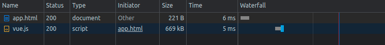

## Task 00: Understand the fundamentals
### This is an introduction to Vue3


Every website start with an index/main/something .html file. 

our main file here is `app.html`

browsers knows how to read this file. 
run or require the scripts code out from the `<script>` tag.



after importing the vue package, vue is now responsible of every thing. such as rendering the DOM logic with the help of the virtual DOM, errors handling, [lazy loading](https://blog.logrocket.com/vue-lazy-loading-components-code-splitting/) and more business logic to achieve the highest performance in your website !
___


To initialize this vue system. we import `Vue`. then we call `createApp` to register the events and connect with the renderer. then we do `mount` to DOM our app inside specific div, for that is the `.mount('#app')`. it does select div with id `app` as a container to render inside.
```
<script src="./vue.js"></script>

<div id="app">{{ message }}</div>

<script>
    const { createApp } = Vue

    createApp({
        data() {
            return {
                message: 'Hello Vue!'
            }
        }
    }).mount('#app')

</script>
```
___________

Vue reactivity implements the [Observer Pattern](https://en.wikipedia.org/wiki/Observer_pattern).
which means, all the data you define are observed. you can watch changes or depend on these changes to trigger some functionality.

 when a reactive data change, all getters do get notify. this simple pattern is important to understand before working with Vue. actually before working with most of the modern frameworks!

We initialize reactive data simply by defining a data prop. see `message` prop in `app.html`. 

when ever `message` changes it does change the message inside the template inside the `{{ message }}`.

___

*bonus: Read about Virtual DOM and Reactive programming!


