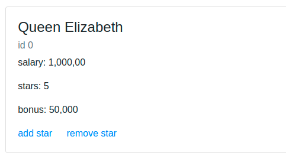

## Task 02: Build a list


___


Your task here is to create a reactive cards list.

Given the data of profiles: 
```
[{
    id: 0,
    name: "Queen Elizabeth",
    salary: 1_000_000,
    stars: 5
 },
 {
    id: 1,
    name: "Prince Charles",
    salary: 500_000,
    stars: 3
 }]
```

build UI that render profiles with all the details. example: 



bonus is calculated as `salary*stars%`

adding or removing star, changes the bonus accordingly.

*you can use the `Rendering` tab in chrome dev tools with the option `Paint flashing` to monitor how DOM is rendering your elements. and make sure it does not render unnecessary elements.

