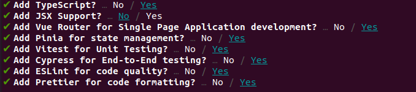

### Task 03: Boosting
### Let us take the things a level up
now our mission is to setup a project environment and fill the requirements

1) make sure you have node >= 16.0

2) init a vue project using the command `npm init vue@latest` with these options:

    

   we will be using:
   - [Typescript](https://www.typescriptlang.org/) as it is recommended and more common with vue3 community.

   - Pinia for state management. [read about Pinia vs vuex](https://www.vuemastery.com/blog/advantages-of-pinia-vs-vuex/)

   - The powerful [Cypress](https://www.youtube.com/watch?v=qZKEbfHY_t0) for e2e tests. and more...

3) enter the project you created:  `cd <your-project-name>`
4) install `npm i`
5) start the dev environment `npm run dev`
___

After you succeed initializing the project, have a walk over the folders and the files. understand what is the structure of the project and how they divided them.

what tools are being used ? 

what is Vite ? 

how does the store works ? 

try to run cypress!

what is plugin in Vue and what plugins are being used ?
